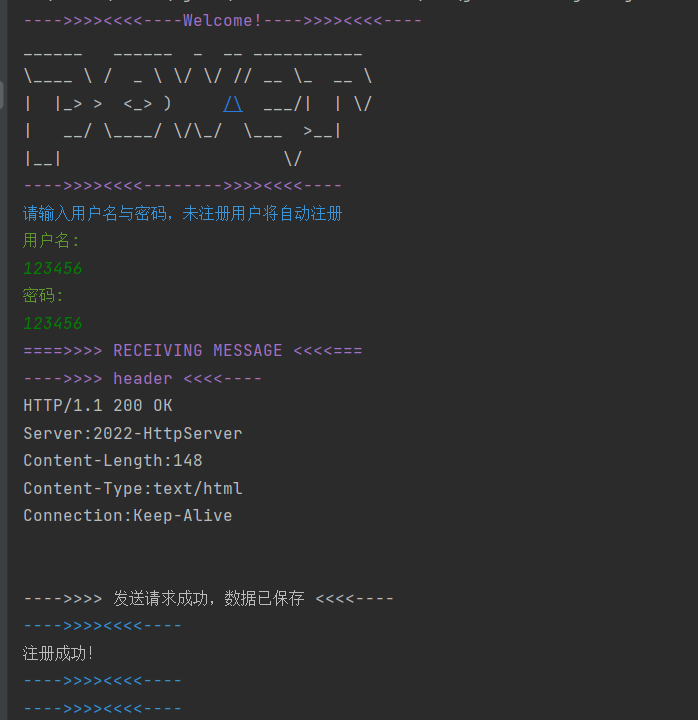
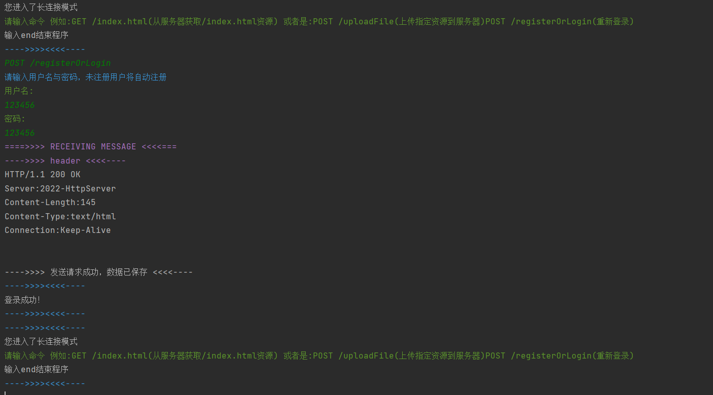
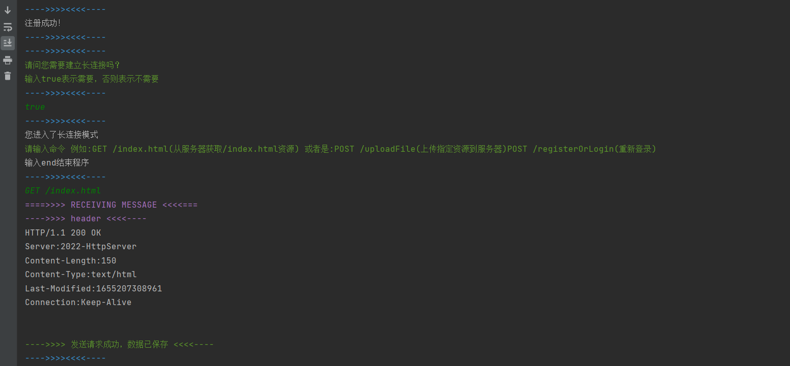
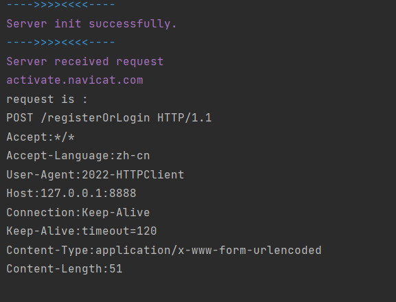

界面展示出来

功能模块有哪些

体现有价值的工作量大的工作

用了哪些技术点

# 团队组成：

| 小组成员 | 分工   |
| -------- | ------ |
| 陈凯文   | 客户端 |
| 蔡之恒   | 服务端 |
| 孙立帆   | 长连接 |
| 王福森   | 服务端 |
| 熊丘桓   | 客户端 |

# 启动方式：

需要先启动类ServerMain中的main方法，再启动测试代码或者ClientMain中的main方法。


# 一、功能展示

插入功能图（蔡）

写一大段话：要写清楚功能模块

（下面展示界面）

## 1、客户端：

### 登录注册功能：

`第一次启动客户端，提示需要注册`



`重新登录`



`输入未注册过的账户名和密码，自动注册并登录新的账户`


### 304状态码

#### 简述：

客户端连续利用GET请求企图获取同一未修改过的资源，自第二次请求器服务器端会返回304状态码，客户端会直接从缓存中获取该资源

`第一次利用GET请求获取资源`



`第二次利用GET请求获取该资源，第三次，第四次等同理`


- 一行说明，一张图片

- 

## 2、服务端：

### 登录注册功能：

`第一次启动客户端时：服务器会打印出请求头以及请求行 `



`分别输入不同的账户名密码时，服务器会打印出请求头以及请求行，当然因为请求体内容不同，Content-Length属性值也不同`


### 304状态码

`客户端连续GET请求/index.html资源情况下，服务器打印请求头请求行信息如下：`


# 二、技术点

1、客户端

- 策略模式，可扩展性强（陈）

  类图如下：

  

  客户端发送请求时可以选择GET或者POST方法，之后需要新增方法只需要新建继承于requestMethod的类即可，可扩展性强。

- 连接池（孙）

- 本地缓存，性能高（孙）

- 长连接（孙）

2、服务端（蔡）

- MIME 支持面大
- 

- 提供用户服务的编程接口，可编程

# 三、关键代码解析

## 登陆注册（陈）

### 简述		

当用户首次使用客户端时，会强制要求其注册，若选择建立长连接，那么之后用户输入POST /registerOrLogin方法便可以实现重新注册或者是登录操作

### NormalClient类中登陆注册方法的实现

```java
public boolean RegisterOrLogin(String input, boolean persistent) throws IOException {
        byte[] bodyBytes=input.getBytes();
        Body body = new Body(bodyBytes);
        try {
            //调用POST请求发送登录注册的请求
            requestMethod.sendRequest("/registerOrLogin", persistent, body);
        } catch (IOException e) {
            e.printStackTrace();
        }
        //读取服务端传回的结果
        FileReader fileReader=new FileReader( "src/main/java/client/Resources/registerOrLogin");
        BufferedReader bufferedReader=new BufferedReader(fileReader);
        String s;
       while (!(s = bufferedReader.readLine()).isEmpty()){
           if(s.contains("Successfully")){
               if(s.contains("Register")){
                   TextDecoration.printBlue(TextDecoration.Head);
                   System.out.println("注册成功！");
                   TextDecoration.printBlue(TextDecoration.Head);
               }
               else if(s.contains("Login")){
                   TextDecoration.printBlue(TextDecoration.Head);
                   System.out.println("登录成功！");
                   TextDecoration.printBlue(TextDecoration.Head);
               }
               return true;
           }
           if(s.contains("Fail")){
               TextDecoration.printBlue(TextDecoration.Head);
               System.out.println("您输入的密码有误，请重试或者重新注册账号！");
               TextDecoration.printBlue(TextDecoration.Head);
               return false;
           }
       }
        return false;
    }
```

### Post（具体策略类）中sendRequest方法的实现

```java
    public void sendRequest(String uri, boolean persistent,Body body) throws IOException {
         Connection conn = null;

        try {
            //从连接池中获取连接
            conn = pool.getConnection(host, port, persistent);
        } catch (IOException e) {
            e.printStackTrace();
        }
        //encapsulate post request
        HttpRequest request = encapsulateRequest(uri, persistent, body);

        OutputStream socketOut = conn.getSendStream();
        //send to server
        socketOut.write(request.toBytes());

        InputStream inputStream = conn.getRecvStream();

        handleResponse(inputStream, uri);

        if(!persistent) pool.removeConnection(host);
    }

```


## 304的实现（蔡服务端，cs客户端）


- 可编程接口的实现（蔡）

四、致谢

ydj，ltf 感谢他们的指导，感谢老师，感谢每一位组员的付出。

五、参考文献


